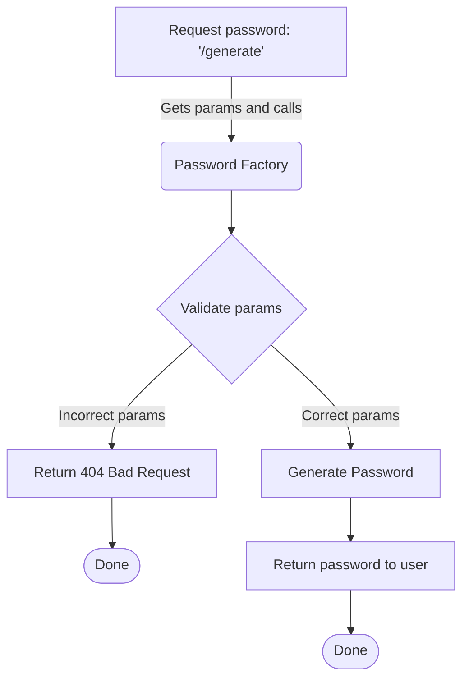

[](https://github.com/ramigiki/passwordfactory/actions/workflows/app.yml)

## Password factory

A Flask application that generate passwords on demand.

### Directory structure

This repository contains code for **Password Factory**

* ``app/`` -- contains code for api, schema, utilities and logger
* ``docker/`` -- docker-compose file and docker files for nginx and webapp. It also contains configs for uwsgi and nginx
* ``tests/`` -- Unit test scripts and Data
* ``postman/`` -- postman collection along with api tests
* ``logs/`` -- Application generated logs will store here

### Important files in the root directory

* ```.env``` -- contatins the server default params. If any param is missing in the API call, it would be filled from this file.
* ```flake8``` -- configurations for linting the code
* ```Makefile``` -- contains the automation scripts
* ```pytest.ini``` -- configurations for testing and coverage report
* ```requirements.txt``` -- lists all the dependencies of the application
*```tests_requirements.txt``` -- list all the dependencies for running the tests.

---

### Starting Development Environment

_Make sure you have installed [python3](https://www.python.org/downloads/)_

* Clone the repository
* Navidate into the code directory

    ```bash
    cd <directory>
    ```

* Run the following command to create virtual environment

    ```bash
    python3 -m venv venv
    ```

* Activate the virtual enviroment using the following command

    ```bash
    source venv/bin/activate
    ```

* Now start dev server using the following command. It will install dependencies and run the developement server on localhost default port 5000 : <http://localhost:5000/generate?numbers=1>

    ```bash
    make start-dev
    ```

* Import the postman collection from the ``postman/`` directory and set environment to 'Password factory' and baseurl to {{local}}.

* Run the API calls to test

### Running Docker Instance (Calibrated for production)

_Make sure you have installed [docker](https://docs.docker.com/install/) and
[docker-compose](https://docs.docker.com/compose/install/)._

* Clone the repository

* Navidate into the code directory

    ```bash
    cd <directory>
    ```

* To fireup docker containers using docker-compose:

    ```bash
    make start-docker
    ```

* The application would be served at <http://localhost/generate?numbers=1>

* To stop docker containers:

    ```bash
    make stop-docker
    ```

* To build docker images from the docker files:

   ```bash
    make build-docker
    ```

* Import the postman collection in the ``postman/`` directory and set environment to 'Password factory' and baseurl to {{docker}}.

* Run the API call to test

### Creating distribution

* Clone the repository

* Navidate into the code directory

    ```bash
    cd <directory>
    ```

* To create distribution files run command

    ```bash
    make dist

    ```

>**Note** A dist directory will be created with tar.gz file. It can be published and installed using setup.py commands

---

### Other Helpful Commands

To only install requirements:

```bash
make install
```

To run unit tests:

```bash
make test
```

To run code linting:

```bash
make lint
```

To format code:

```bash
make format
```

### API documentation and testing

* ``postman/`` -- contains api collection which can be imported to postman. Each API call is documented.
* postman tests are written against each api call which can be exectued through postman run collection

---

### Flowchart diagram of /generate api call

>**Note** Diagram is created using mermaid code, only visible in repository.


